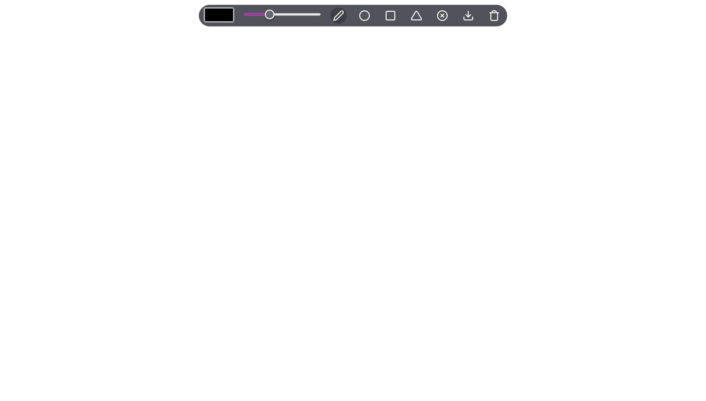

# Drawing app - Um site para desenhar

## Tabela de conteúdos

- [Geral](#geral)
  - [Screenshot](#screenshot)
  - [Desenvolvido com](#desenvolvido-com)
  - [O que aprendi](#o-que-aprendi)
  - [Desenvolvimento contínuo](#desenvolvimento-continuo)
  - [Recursos úteis](#recursos-uteis)
- [Autor](#autor)
- [Reconhecimentos](#reconhecimentos)

## Geral

### Screenshot

### Desenvolvido com

- HTML5
- CSS3
- JavaScript
- p5.js

### O que aprendi

Nesse projeto pude praticar minha lógica de programação, principalmente nas funções onde o usuário poderia escolher uma forma (retângulo, círculo ou triângulo), além de ter lido e estudado a documentação da biblioteca p5.js.

### Recursos úteis

- [Documentação da biblioteca p5.js](https://p5js.org/reference/)

## Autor

- GitHub - [marcelosarinho](https://github.com/marcelosarinho)
- LinkedIn - [Marcelo Sarinho](www.linkedin.com/in/marcelo-sarinho)